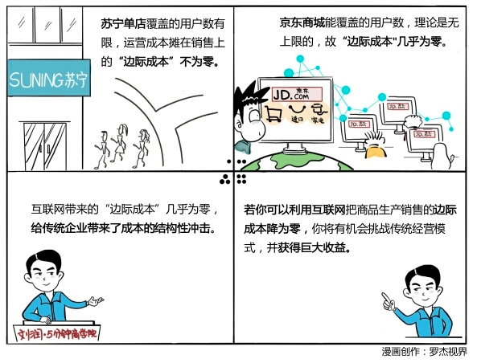

#013｜理论上，你可以服务全人类
刘润2016年10月11日

##概念：边际成本

边际成本指的是每多生产或者每多卖一件产品，所带来的总成本的增加。边际成本的结构性改变，是互联网经济对传统经济最重要的一个冲击。

###案例

>1、苏宁 VS 京东

>苏宁的门店，只能服务半径20公里的用户，想要服务更多用户，就只能在20公里外再开家店。把单店的运营成本，摊薄在每次销售上，“边际成本”一定不为零。所以，单店是否盈利，非常重要。

>但京东不同。它理论上可以覆盖全中国，甚至覆盖全世界。京东商城前期投入巨大，一直不赚钱，但投资人依然对京东有很大的信心，是因为京东商城所能覆盖的用户数，理论是无上限的，所以“边际成本”会不断递减，最终接近于零。9000万不赚钱，那1.2亿呢？1.5亿呢？总有一个数字，最终会让京东赚钱。从那一天开始，京东每卖一样商品，他的边际成本，几乎为零。

>2、电报 VS 短信 VS 微信

>中国邮政的电报，是按字算钱，非常贵。后来中国电信、中国移动，通过大规模光纤的铺设，连通了全中国，虽然固定投入巨大，但是边际成本很低，每条短信只要1毛钱。但是腾讯公司，在电信、移动的数据网络基础上，又推出了微信，边际成本几乎为零，聊天免费。

##运用：场景

- 场景1：Uber、Airbnb VS 传统出租车公司、传统酒店

Uber 增加一辆车和一名司机的成本，Airbnb 增加一间新的出租屋的成本，都基本为零。但是，传统的出租车公司和传统的酒店，就不一样了。

- 场景2：5分钟商学院 VS 线下商学院

如果选择开一家线下商学院，一堂课如果有100人报名，酒店成本、人员成本、差旅成本、我的时间成本，导致每一个学员的“边际成本”会非常高，所以收费也必然会很高。

可是，利用互联网得到APP的平台，让每一个《5分钟商学院》订阅的边际成本几乎为零，所以这199元，在以前看来完全不可能的价格，因为“边际成本”为零，让每个人都有机会用和朋友吃一顿饭的钱，学习如何做自己的CEO。

##小结：如何利用这个“结构性冲击”，成就生意？

互联网带来的用户规模理论无上限，“边际成本”几乎为零，给传统企业带来了成本的结构性冲击。

认真梳理你的每一件商品的生产、销售的边际成本，看看互联网是否能把它降为零。如果可以，你将有机会通过极大降低边际成本，挑战传统经营模式，并获得巨大收益。
