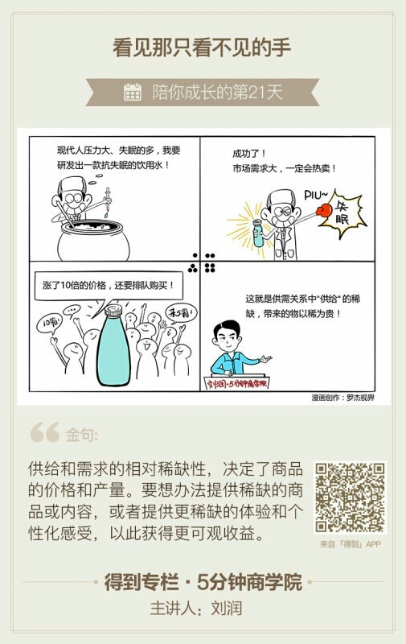

#021｜看见那只看不见的手
刘润2016年10月23日

这一周，我将与大家聊一聊经济学中最重要的领域之一，微观经济学。今天，我们从微观经济学中最核心的概念开始：**供需理论**。这个概念重要到什么程度呢？著名经济学家萨谬尔森曾说：你只要教懂一只鹦鹉说“供给”和“需求”，它就能成为经济学家。

##概念：供需理论

供需理论是一个经济学模型，是说在竞争性市场中，供给和需求的相对稀缺性，决定了商品的价格和产量。

这种供需关系通过价格和竞争自我调节的现象，就是亚当·斯密在《国富论》里所说的那个著名的：看不见的手。

###案例：拿破仑的铝碗

>法国皇帝拿破仑，宴请客人的时候，餐桌上客人的用具几乎全是银制的餐具，唯有他自己用一个铝碗。你可能觉得这是拿破仑谦卑的表现，但其实这是为了显示他的“尊贵”。200年前的拿破仑时代，冶炼金银已有很长历史，银器在宫廷中比比皆是。但那个时候，人们才刚刚学会从铝矾土中炼出铝来，技术非常落后，所以，铝碗非常罕见。

##运用：淘宝的效率

网上曾有一篇文章，叫《淘宝不死，中国不富》，大意是说淘宝让商家们进行非常惨烈的比价，把所有商品的价格压得非常低，商家们就都赚不到钱。因此淘宝如果不死，中国就富不起来。但是，如果你理解了供需理论，并看见了那只“看不见的手”，就会明白，中国很多企业赚不到钱不是因为淘宝，而是因为供需关系。

我们的商业有个问题，只要有人做了个东西赚了钱，全中国的同行和外行就一拥而上，以迅雷不及掩耳盗铃之势进行模仿，导致到处都是一模一样的山寨品。供给极大增加，远超出有效需求，价格迅速下跌。

但在过去，这只“看不见的手”忙不过来，调节市场有些慢。淘宝说，放着我来！它做了个叫“价格排序”的按钮，帮助“看不见的手”，提高干掉过度产能的效率。后来天猫、京东、一号店等等说，我也来帮忙。

中国企业赚不到钱，不是因为淘宝。淘宝只是提高了市场自我调节的效率。中国企业赚不到钱，是因为供给侧太同质化，产能严重过剩。这也是为什么国家要把“去产能、去库存”的供给侧改革，作为重要发展战略。

供给少会导致价格上升，价格上升会导致需求下降和供给的攀升。供给多又会导致价格下降，价格下降又会导致需求上升，供给减少。如此往复，最终平衡。

##小结：如何调节商业策略呢？

1. 提供稀缺的商品或内容
      比如，你是一个微信公号的运营者，除了苦苦写文章，看着订阅数量一个两个增长外，也要思考一下，你供给的是不是稀缺内容。看不见的手，正在把你往真正稀缺的原创优质内容调拨。你要听它的话。
2. 提供稀缺的能力或方法
   如果你不想在这个博弈游戏里疲于奔命，那请你想一想，你到底拥有什么稀缺的东西，可以提供给消费者。比功能更稀缺的，是体验，比体验更稀缺的，是个性化。比如，大家今天稀缺的不是免费的商业知识，网上太多了。大家稀缺的，反而变成了用来把这些知识内化的“时间”。《刘润·5分钟商学院》，其实就是提供了一种稀缺的能力，能帮你用最少的时间，学到最有用的商业知识。

