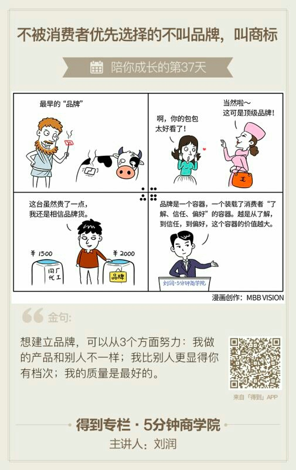

#037｜不被消费者优先选择的，不叫品牌，叫商标
刘润2016年11月14日

##概念：品牌容器

品牌是一个容器，一个装载消费者“了解、信任、偏好”的容器。越是从了解，到信任，到偏好，这个容器的价值就越大。不能被消费者优先选择的，不叫品牌，叫商标。

###案例

>比如，今天你去逛家电商场，看中一台冰箱，海尔的，耗电量，容量，大小都符合你的要求，价格2000块。刚要买，一个售货员冲过来：千万别买啊，他们的冰箱，都是我们给代工的，你看我这台，耗电量、容量、大小，甚至材质，完全一样的。我们只卖1500。买我的吧。

>你会买哪一台？

>我会买海尔的。为什么呢？因为，你说一样就一样啊？为了判断你们俩是不是真的一样，我需要花很多时间，像专家一样的了解，然后基于了解产生信任，基于信任产生偏好。这个过程，就是我买那台没有品牌的冰箱的“交易成本”，估计可能花费的金钱、时间，800元都打不住。而海尔，通过这么多年的运营，把“了解、信任、偏好”都装进了这个叫“海尔”的品牌容器里。我看到这两个字，就直接产生“偏好”，虽然贵了500元，但是相对于无牌厂家的800元交易成本，还是便宜的。

##运用：建立“品牌容器”的三种方法

**第一，从你的产品中，抽取一种叫做“品类”的特殊价值，装进品牌容器。**

品类指的是，你做的产品，和别人不是一类。你解决的是也许很细分，但是很独特的需求。你希望你的客户，在这个细分的品类选择上，因为对你的了解，而越来越信任，最后产生偏好。比如“怕上火，就喝王老吉”。饮料无数种，但是王老吉创立了一个“品类”，然后通过广告、营销、赞助综艺节目，不断往这个容器里注入品类价值，让消费者最终产生偏好。特劳特甚至根据“品类价值”，提出了著名的“定位理论”。

**第二，往品牌容器里注入“品位”价值。**

品位价值比较感性。有些人特别喜欢一个品牌是因为它的品牌故事，比如Chanel创始人香奈儿女士的才华、名利、恋情和女权思想一直被人们津津乐道；也有人喜欢的是品牌背后的设计模式，比如说LV包包经典耐看的图案，GUCCI时装的性感奢华；还有人喜欢品牌带来的同伴认可，比如戴上万国手表让朋友们觉得他很有品位。品位价值，甚至产生了我们在第20期讲的“凡勃伦效应”，不买最好，只买最贵。

**第三，往品牌容器里注入“品质”价值。**

20世纪80年代初，日本经济增长处于停滞状态，无印良品在1983年应运而生。无印良品的口号是“物有所值”，强调“品质”价值。它的产品拿掉了商标，包装设计非常简洁，去掉了一切不必要的加工和颜色，降低了成本和价格。强调“去品牌溢价”，仅突出品质的无印良品，今天反而因此成为了著名品牌。我们提到的海尔，显然，他的“品牌容器”里，满满的都是品质价值。

##小结：怎么建设品牌？

努力是必须的。但努力之前，你首先要想清楚，你打算往“品牌容器”里，注入：1）品类价值，也就是我和别人不一样，还是2）品位价值，我比别人更显得你有档次；还是3）品质价值，我的质量是最好的。

